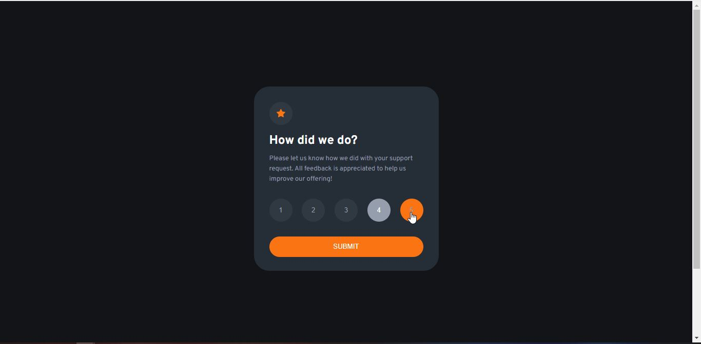
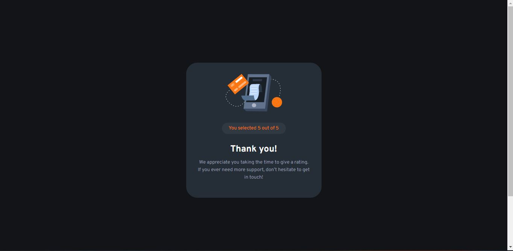

# Frontend Mentor - Interactive rating component solution

This is a solution to the [Interactive rating component challenge on Frontend Mentor](https://www.frontendmentor.io/challenges/interactive-rating-component-koxpeBUmI). Frontend Mentor challenges help you improve your coding skills by building realistic projects. 

## Table of contents

- [Overview](#overview)
  - [The challenge](#the-challenge)
  - [Screenshot](#screenshot)
  - [Links](#links)
- [My process](#my-process)
  - [Built with](#built-with)
  - [What I learned](#what-i-learned)
- [Author](#author)

## Overview

### The challenge

Users should be able to:

- View the optimal layout for the app depending on their device's screen size
- See hover states for all interactive elements on the page
- Select and submit a number rating
- See the "Thank you" card state after submitting a rating

### Screenshot

### Links

- Solution URL: [https://github.com/romariobarbosa/interactive-rating-component](https://github.com/romariobarbosa/interactive-rating-component)
- Live Site URL: [https://romariobarbosa.github.io/interactive-rating-component](https://romariobarbosa.github.io/interactive-rating-component)

## My process

### Built with

- Semantic HTML5 markup
- CSS custom properties
- Flexbox
- Javascript

### What I learned

During the development of the project, I was able to learn a lot, but what really challenged me was javascript. In the end, I managed to complete the challenge and I'm very proud of the result.

## Author

- Frontend Mentor - [@romariobarbosa](https://www.frontendmentor.io/profile/romariobarbosa)
- LinkedIn - [@Romário Barbosa](https://www.linkedin.com/in/romario-barbosa-744650138/)
